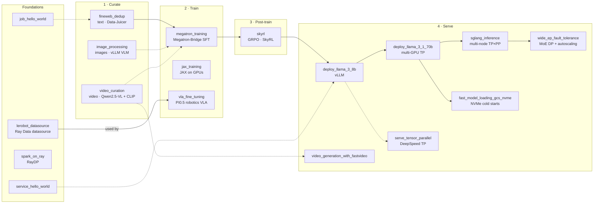

# The Open-Source Frontier Infra Stack

Runnable examples for every stage of the LLM lifecycle — **curate → train → post-train → serve** — built entirely on open-source frontier infrastructure, orchestrated by [Ray](https://github.com/ray-project/ray), and runnable with one command on [Anyscale](https://www.anyscale.com).

Each directory is a self-contained example: code, a Dockerfile, and an Anyscale `job.yaml` or `service.yaml`. The examples chain together — the corpus you curate feeds the model you fine-tune, the checkpoint you align is the model you serve — so you can follow the full pipeline or jump straight to the stage you care about.

## The map



Solid arrows are artifact flow (a corpus, a checkpoint); dashed arrows are conceptual feeds and related approaches. The same map is browsable as an [interactive explorer](#interactive-explorer) with guided journeys, search, and per-example run commands.

## Start here

- **Never used Ray or Anyscale?** Start with [job_hello_world](job_hello_world/) and [service_hello_world](service_hello_world/) — the submit/deploy loop every other example uses.
- **Want the whole story?** Follow the headline journey below: curate → fine-tune → align → serve.
- **Looking for something specific?** Jump to the [stage tables](#all-examples) or open the [interactive explorer](#interactive-explorer) and press `⌘K`.

## Journeys

Curated trails through the map. Follow one top to bottom — each stop builds on the last.

**The full LLM lifecycle** — curate a corpus, fine-tune, align with RL, and serve it.
[fineweb_dedup](fineweb_dedup/) → [megatron_training](megatron_training/) → [skyrl](skyrl/) → [deploy_llama_3_8b](deploy_llama_3_8b/) → [wide_ep_fault_tolerance](wide_ep_fault_tolerance/)

**Pretraining data factory** — web-scale curation across text, image, and video.
[fineweb_dedup](fineweb_dedup/) → [image_processing](image_processing/) → [video_curation](video_curation/)

**Train and align** — from a first distributed run to Megatron-parallel SFT to RL.
[jax_training](jax_training/) → [megatron_training](megatron_training/) → [skyrl](skyrl/)

**Serve at scale** — one endpoint to MoE fleets; every step adds a production concern.
[service_hello_world](service_hello_world/) → [deploy_llama_3_8b](deploy_llama_3_8b/) → [serve_tensor_parallel](serve_tensor_parallel/) → [deploy_llama_3_1_70b](deploy_llama_3_1_70b/) → [sglang_inference](sglang_inference/) → [wide_ep_fault_tolerance](wide_ep_fault_tolerance/) → [fast_model_loading_gcs_nvme](fast_model_loading_gcs_nvme/)

**Zero to Ray** — four small steps from hello world to distributed GPU training.
[job_hello_world](job_hello_world/) → [service_hello_world](service_hello_world/) → [spark_on_ray](spark_on_ray/) → [jax_training](jax_training/)

**Robotics: data to VLA** — stream robot episodes from S3 and fine-tune a vision-language-action model.
[lerobot_datasource](lerobot_datasource/) → [vla_fine_tuning](vla_fine_tuning/)

## All examples

### 1 · Curate — turn raw web-scale data into training fuel

| Example | What it shows | Open-source stack | Runs as |
|---|---|---|---|
| [fineweb_dedup](fineweb_dedup/) | Clean, filter, and MinHash-dedup the FineWeb-edu corpus | Data-Juicer, Ray Data | job |
| [image_processing](image_processing/) | Caption 2B image URLs with a vision-language model | Ray Data, vLLM, Qwen2.5-VL | job |
| [video_curation](video_curation/) | Stream raw video into annotated, embedded clip datasets | Ray Data, vLLM, CLIP | job |

### 2 · Train — distributed training on heterogeneous clusters

| Example | What it shows | Open-source stack | Runs as |
|---|---|---|---|
| [megatron_training](megatron_training/) | SFT with tensor + pipeline + data parallelism on 8 GPUs | Megatron-Bridge, Transformer Engine, Ray Train | job |
| [jax_training](jax_training/) | A JAX training loop across 16 GPUs | JAX, Ray Train | job |
| [vla_fine_tuning](vla_fine_tuning/) | Fine-tune the PI0.5 robotics VLA on LeRobot data from S3 | LeRobot, Ray Data, Ray Train, PyTorch | job |

### 3 · Post-train — align models with reinforcement learning

| Example | What it shows | Open-source stack | Runs as |
|---|---|---|---|
| [skyrl](skyrl/) | GRPO on GSM8K with colocated vLLM rollout engines | SkyRL, vLLM, Ray | job |

### 4 · Serve — production inference, from one GPU to MoE fleets

| Example | What it shows | Open-source stack | Runs as |
|---|---|---|---|
| [deploy_llama_3_8b](deploy_llama_3_8b/) | The canonical LLM service: autoscaling, OpenAI-compatible | Ray Serve LLM, vLLM | service |
| [deploy_llama_3_1_70b](deploy_llama_3_1_70b/) | A 70B model sharded across GPUs with tensor parallelism | Ray Serve LLM, vLLM | service |
| [serve_tensor_parallel](serve_tensor_parallel/) | Tensor parallelism built by hand, to see how it works | Ray Serve, DeepSpeed, Transformers | service |
| [sglang_inference](sglang_inference/) | TP×PP inference spanning 2 nodes, batch or online | SGLang, Ray Serve | job + service |
| [wide_ep_fault_tolerance](wide_ep_fault_tolerance/) | MoE DP groups with atomic gang restarts and autoscaling | Ray Serve LLM, vLLM, Locust | service |
| [fast_model_loading_gcs_nvme](fast_model_loading_gcs_nvme/) | Cold starts cut ~6× with GCS → NVMe → GPU streaming | vLLM, Run:ai Model Streamer | service |
| [video_generation_with_fastvideo](video_generation_with_fastvideo/) | Text-to-video generation behind a Gradio UI | FastVideo, Ray Serve, Gradio | service |

### Foundations — Ray + Anyscale basics every example builds on

| Example | What it shows | Open-source stack | Runs as |
|---|---|---|---|
| [job_hello_world](job_hello_world/) | Your first Ray job: 100 tasks across a cluster | Ray Core | job |
| [service_hello_world](service_hello_world/) | Your first Ray Serve endpoint | Ray Serve | service |
| [spark_on_ray](spark_on_ray/) | Run existing Spark code on a Ray cluster | RayDP, Apache Spark | job |
| [lerobot_datasource](lerobot_datasource/) | A custom Ray Data datasource for LeRobot v3 datasets | Ray Data, LeRobot, PyAV | library |

## Built on open source

This cookbook exists because of the open-source projects below. Each example's README cites the libraries it uses; this is the full roster.

| Project | What it does here | Used in |
|---|---|---|
| [Ray](https://github.com/ray-project/ray) | Distributed compute engine under everything: Ray Data, Ray Train, Ray Serve, Ray Core | all examples |
| [vLLM](https://github.com/vllm-project/vllm) | High-throughput LLM inference engine | image_processing, video_curation, skyrl, deploy_llama_3_8b, deploy_llama_3_1_70b, wide_ep_fault_tolerance, fast_model_loading_gcs_nvme |
| [SGLang](https://github.com/sgl-project/sglang) | Tensor- and pipeline-parallel inference engine | sglang_inference |
| [Megatron-LM](https://github.com/NVIDIA/Megatron-LM) | Parallel transformer training core | megatron_training |
| [Megatron-Bridge](https://github.com/NVIDIA-NeMo/Megatron-Bridge) | Hugging Face ↔ Megatron bridge and training recipes | megatron_training |
| [Transformer Engine](https://github.com/NVIDIA/TransformerEngine) | Fused attention/GEMM kernels, BF16/FP8 | megatron_training |
| [SkyRL](https://github.com/NovaSky-AI/SkyRL) | RL post-training library (PPO, GRPO, DAPO) | skyrl |
| [Data-Juicer](https://github.com/datajuicer/data-juicer) | Text/multimodal data processing operators | fineweb_dedup |
| [JAX](https://github.com/jax-ml/jax) | Composable array computing and autodiff | jax_training |
| [PyTorch](https://github.com/pytorch/pytorch) | Deep-learning framework for training examples | megatron_training, vla_fine_tuning, skyrl |
| [Hugging Face Transformers](https://github.com/huggingface/transformers) | Models and tokenizers | serve_tensor_parallel and model loading throughout |
| [LeRobot](https://github.com/huggingface/lerobot) | Robotics dataset format and tooling | lerobot_datasource, vla_fine_tuning |
| [FastVideo](https://github.com/hao-ai-lab/FastVideo) | Video generation inference framework | video_generation_with_fastvideo |
| [DeepSpeed](https://github.com/deepspeedai/DeepSpeed) | Distributed inference/training optimizations | serve_tensor_parallel |
| [RayDP](https://github.com/ray-project/raydp) | Spark on Ray | spark_on_ray |
| [Apache Spark](https://github.com/apache/spark) | DataFrame processing engine | spark_on_ray |
| [Run:ai Model Streamer](https://github.com/run-ai/runai-model-streamer) | Concurrent weight streaming to GPU | fast_model_loading_gcs_nvme |
| [Gradio](https://github.com/gradio-app/gradio) | Interactive ML UIs | video_generation_with_fastvideo |
| [Locust](https://github.com/locustio/locust) | Load testing | wide_ep_fault_tolerance |
| [uv](https://github.com/astral-sh/uv) | Fast Python environment management | skyrl, wide_ep_fault_tolerance, lerobot_datasource |
| [PyAV](https://github.com/PyAV-Org/PyAV) | Video decoding | lerobot_datasource |

## Interactive explorer

The [`site/`](site/) directory contains an interactive map of this repository: pan and zoom the pipeline, follow guided journeys step by step, search everything with `⌘K`, and copy run commands per example.

```bash
cd site
npm install
npm run dev
```

The site is a static Vite + React build, deployable to GitHub Pages via the included [workflow](.github/workflows/deploy-site.yml) once Pages is enabled for the repository (Settings → Pages → Source: GitHub Actions). See [site/README.md](site/README.md) for details.

## Running the examples

Every example follows the same loop:

```bash
pip install -U anyscale
anyscale login

git clone https://github.com/anyscale/examples.git
cd examples/<example_dir>

anyscale job submit -f job.yaml        # or: anyscale service deploy -f service.yaml
```

Each README lists the exact command, required environment variables (such as `HF_TOKEN` for gated Hugging Face models or datasets), and how to inspect results. Jobs appear in the [Anyscale console](https://console.anyscale.com/jobs); services in the [services tab](https://console.anyscale.com/services).

These examples are also published as tutorials at [docs.anyscale.com/tutorials](https://docs.anyscale.com/tutorials/), kept in sync from this repository (see [CONTRIBUTING.md](CONTRIBUTING.md)).

## Contributing

New examples are welcome — see [CONTRIBUTING.md](CONTRIBUTING.md) for the README template, the catalog entry that places your example on the map, and the consistency checks (`cd site && npm run check`) that keep the map, the READMEs, and the file links honest.
