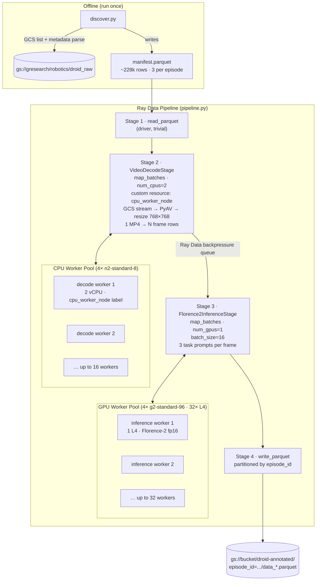

# DROID → Florence-2 Dense Annotation Pipeline

A production-quality [Ray Data](https://docs.ray.io/en/latest/data/data.html) pipeline that reads the [DROID robotics dataset](https://droid-dataset.github.io/) in raw MP4 format from Google Cloud Storage, decodes video frames on CPU workers, and runs [Microsoft Florence-2](https://huggingface.co/microsoft/Florence-2-large-ft) multi-task inference on GPU workers to produce dense annotations (captions, object detection, phrase grounding).

The pipeline demonstrates **heterogeneous compute** — CPU and GPU worker pools that scale independently, with Ray Data handling backpressure between them automatically.

---

## Architecture



### Cluster Topology

| Node type | Machine | Count | Role |
|---|---|---|---|
| Head node | n2-standard-16 (16 vCPU, 64 GB) | 1 | Runs driver (`pipeline.py`), no data work |
| CPU workers | n2-standard-8 (8 vCPU, 32 GB) | 4 | Video decode — `VideoDecodeStage` |
| GPU workers | g2-standard-96 (48 vCPU, 384 GB, 8× L4) | 4 | Florence-2 inference |

**Total GPU capacity:** 32× NVIDIA L4 (24 GB VRAM each)

---

## Dataset: DROID Raw on GCS

The DROID dataset raw episodes live at `gs://gresearch/robotics/droid_raw/1.0.1/`.

```
droid_raw/1.0.1/<success_or_failure>/<date>/<episode_id>/
├── metadata_*.json           # language_instruction, camera serials, building/collector IDs
├── trajectory.h5             # low-dim actions, proprioception, timestamps
└── recordings/
    ├── MP4/
    │   ├── <serial>.mp4        # left-eye HD video  ← pipeline uses these
    │   └── <serial>-stereo.mp4 # concatenated stereo pair  ← skipped
    └── SVO/
        └── <serial>.svo        # ZED raw files  ← skipped
```

- ~76,000 episodes, 3 cameras each → ~228,000 MP4 files
- ~8.7 TB total (stereo) / ~5.6 TB (non-stereo)
- This pipeline uses only the **left-eye (non-stereo) MP4s**

---

## File Structure

```
ray-droid-florence2-demo/
├── pyproject.toml      uv-managed dependencies
├── README.md           This file
├── cluster.yaml        Ray GCP cluster config (head + CPU + GPU nodes)
├── discover.py         Step 0: offline GCS discovery → manifest.parquet
├── pipeline.py         Main entry point — CLI + pipeline wiring
├── preprocessing.py    CPU stage: GCS download, PyAV decode, resize
├── inference.py        GPU stage: Florence-2 callable class
└── config.py           All knobs: concurrency, batch sizes, model name, GCS paths
```

---

## Quick Start

### 1. Install dependencies

```bash
# Requires Python ≥ 3.10 and uv
pip install uv

# Install all project dependencies into a venv
uv sync
```

For GPU workers, install the CUDA-enabled PyTorch wheel:
```bash
uv pip install torch torchvision --index-url https://download.pytorch.org/whl/cu124
```

### 2. Discover episodes (run once)

```bash
# Smoke test: first 100 episodes (~300 MP4s → ~300 manifest rows)
uv run python discover.py --output manifest.parquet --max-episodes 100

# Full dataset (~76k episodes, ~228k rows — takes ~10 min on fast network)
uv run python discover.py --output manifest.parquet
```

Output: `manifest.parquet` with columns:
`episode_id, success, date, language_instruction, building_id, collector_id, camera_serial, camera_name, mp4_gcs_path, trajectory_gcs_path`

Inspect it:
```python
import pandas as pd
df = pd.read_parquet("manifest.parquet")
print(df.head())
print(f"{len(df)} rows, {df['episode_id'].nunique()} unique episodes")
```

### 3. Deploy the Ray cluster

```bash
# Edit cluster.yaml: set project_id and YOUR_BUCKET
ray up cluster.yaml

# Verify cluster health
ray status
```

### 4. Run the pipeline

```bash
# On the Ray head node — full run
uv run python pipeline.py --manifest manifest.parquet \
    --output-prefix gs://YOUR_BUCKET/droid-annotated

# Smoke test: 10 episodes, sample every 5th frame
uv run python pipeline.py --manifest manifest.parquet \
    --max-episodes 10 \
    --frame-stride 5 \
    --gpu-batch-size 4

# Using ray submit from your local machine
ray submit cluster.yaml pipeline.py \
    -- --manifest manifest.parquet \
    --output-prefix gs://YOUR_BUCKET/droid-annotated
```

### 5. Inspect output

```python
import pyarrow.dataset as pds

ds = pds.dataset("gs://YOUR_BUCKET/droid-annotated/", format="parquet")
df = ds.to_table(
    filter=pds.field("episode_id") == "some_episode_id"
).to_pandas()

import json
print(df["dense_captions"].iloc[0])
print(json.loads(df["object_detections"].iloc[0]))
```

---

## Pipeline Configuration

All knobs are in [config.py](config.py). Key settings:

| Setting | Default | Description |
|---|---|---|
| `MODEL_NAME` | `microsoft/Florence-2-large-ft` | Florence-2 variant |
| `FRAME_STRIDE` | `10` | Sample every Nth frame (10 @ 30fps = 3fps) |
| `FRAME_SIZE` | `(768, 768)` | Resize target (pixels) |
| `CPU_CONCURRENCY` | `(8, 16)` | CPU decode worker pool size range |
| `GPU_CONCURRENCY` | `(24, 32)` | GPU inference worker pool size range |
| `GPU_BATCH_SIZE` | `16` | Frames per GPU batch |
| `TORCH_COMPILE` | `False` | Enable torch.compile for ~20% speedup |
| `GCS_OUTPUT_PREFIX` | `gs://YOUR_BUCKET/droid-annotated` | Output path |

Override at runtime with CLI flags — see `uv run python pipeline.py --help`.

---

## Heterogeneous Compute: CPU/GPU Disaggregation

### Why separate CPU and GPU pools?

Video decode and model inference have fundamentally different resource profiles:

| Stage | Bottleneck | Resources |
|---|---|---|
| Video decode | GCS network I/O + CPU decode | 2 vCPU, ~2 GB RAM, 0 GPU |
| Florence-2 inference | GPU VRAM and tensor cores | 0 CPU (post-init), 1 L4 GPU |

If decode and inference ran on the **same** nodes, they would compete for CPU time and GPU memory, leaving the GPU underutilised during heavy decode phases. By separating the pools:

1. **CPU worker nodes** decode continuously without waiting for GPU availability.
2. **GPU worker nodes** run inference at full utilisation without CPU decode competing.
3. **Ray Data** applies automatic backpressure: if the GPU pool is saturated, Ray stops launching new decode tasks until the frame queue drains.

### Custom resource label routing

The critical mechanism that keeps decode off GPU nodes is a **custom resource label** in `cluster.yaml`:

```yaml
# CPU worker nodes declare:
resources:
  cpu_worker_node: 8   # ← only present on n2-standard-8 nodes

# GPU worker nodes declare:
resources:
  GPU: 8               # ← no cpu_worker_node label
```

In `pipeline.py`, the CPU decode stage requests this label:

```python
ds.map_batches(
    VideoDecodeStage,
    num_cpus=2,
    resources={"cpu_worker_node": 0.001},  # ← only schedulable on CPU nodes
    ...
)
```

The GPU inference stage requests `num_gpus=1` with no CPU node label, so it lands exclusively on GPU nodes.

---

## Tuning Guide

### CPU worker node count sizing

The goal is to have CPU decode produce frames fast enough to saturate all 32 L4 GPUs.

**GPU throughput (demand):**
- Florence-2-large-ft, 768×768, fp16, L4: ~40–60 fps per GPU (single task)
- With 3 task prompts: ~15–20 effective fps per GPU
- 32 GPUs × 15–20 fps = **480–640 frames/sec total demand**

**CPU decode throughput (supply):**
- PyAV decode + GCS download + resize: ~30–50 fps per worker (2 vCPU)
- Bottlenecked by GCS download latency (~100–300 ms/file)

**Required CPU workers:**
```
workers_needed = gpu_demand_fps / decode_fps_per_worker
               = 500 / 40
               = 12–16 workers
```

**Node sizing:**
- 2 vCPU per worker (PyAV uses one decode thread)
- 4 workers per n2-standard-8 (8 vCPU / 2 vCPU)
- 4 nodes × 4 workers = **16 decode workers** (starting point)

**Recommended initial config:** `4× n2-standard-8` → scale up to `8× n2-standard-8` if GPU utilisation falls below 90%.

### Monitoring

```bash
# Ray dashboard (open in browser)
ray dashboard cluster.yaml

# Check GPU utilisation on a GPU worker
ssh <gpu-worker-ip> 'watch -n1 nvidia-smi'

# Check Ray Data progress
ray list actors
ray memory --stats-only
```

### Scaling levers

| Symptom | Action |
|---|---|
| GPU util < 80% | Add CPU worker nodes (increase `max_workers` for `cpu_worker` type) |
| CPU workers idle | Reduce `GPU_BATCH_SIZE` or increase `GPU_CONCURRENCY` max |
| OOM on GPU workers | Reduce `GPU_BATCH_SIZE` (try 8) |
| OOM on CPU workers | Reduce `CPU_CONCURRENCY` max or increase RAM per node |
| Slow GCS downloads | Enable [GCS transfer acceleration](https://cloud.google.com/storage/docs/resumable-uploads) or co-locate workers in same region as `us-central1` |

### Expected throughput

With the default cluster (4 CPU + 4 GPU nodes, 32 L4s):

| Metric | Value |
|---|---|
| Frames/sec (GPU inference) | ~500–640 |
| MP4s/sec (CPU decode) | ~12–16 |
| Episodes/hour (at 30fps, 30s video) | ~1,400–1,900 |
| Full 76k-episode run (3 cameras each) | ~40–55 hours |
| Full run with 8 CPU node nodes (32 decode workers) | ~30–40 hours |

---

## Output Schema

Each output Parquet file (partitioned by `episode_id`):

| Column | Type | Description |
|---|---|---|
| `episode_id` | string | DROID episode identifier |
| `camera_name` | string | Camera label (e.g., "exterior_1", serial number) |
| `frame_idx` | int32 | Zero-based frame index in original video |
| `timestamp_sec` | float64 | Presentation timestamp in seconds |
| `language_instruction` | string | Task description from metadata |
| `dense_captions` | string (JSON) | Florence-2 `<DENSE_REGION_CAPTION>` result |
| `object_detections` | string (JSON) | Florence-2 `<OD>` result (labels + boxes) |
| `grounded_phrases` | string (JSON) | Florence-2 `<CAPTION_TO_PHRASE_GROUNDING>` result |
| `image_png_bytes` | binary | PNG-encoded frame (768×768 RGB) |

Example `object_detections` value:
```json
{
  "bboxes": [[120, 45, 380, 290], [400, 100, 620, 380]],
  "labels": ["robotic arm", "table"]
}
```

---

## Florence-2 Task Prompts

| Prompt | Output | Usage |
|---|---|---|
| `<DENSE_REGION_CAPTION>` | Per-region text descriptions + bounding boxes | Rich scene understanding |
| `<OD>` | Object labels + bounding boxes | Spatial object inventory |
| `<CAPTION_TO_PHRASE_GROUNDING>` | Task-instruction phrases grounded to image regions | Connect language_instruction to visual context |

For `<CAPTION_TO_PHRASE_GROUNDING>`, the `language_instruction` from the episode metadata is appended as the text prompt, e.g.:
```
<CAPTION_TO_PHRASE_GROUNDING>pick up the red cup and place it on the shelf
```

---

## GCS Credentials

**Public DROID dataset (input):** No credentials needed — uses anonymous GCS client.

**Private output bucket:** Set Application Default Credentials:
```bash
gcloud auth application-default login
# or on cluster nodes:
gcloud auth activate-service-account --key-file=sa-key.json
```

Or mount credentials in `cluster.yaml`:
```yaml
file_mounts:
  "/home/ray/.config/gcloud/application_default_credentials.json":
    source: "~/.config/gcloud/application_default_credentials.json"
```

---

## Development / Local Testing

```bash
# Install in development mode
uv sync

# Test discover on a tiny slice (uses anonymous GCS access)
uv run python discover.py --output test_manifest.parquet --max-episodes 3

# Test the pipeline locally (no Ray cluster — Ray starts in-process)
# Requires at least one GPU for inference, or set num_gpus=0 for CPU-only test
uv run python pipeline.py \
    --manifest test_manifest.parquet \
    --max-episodes 2 \
    --frame-stride 30 \
    --gpu-batch-size 2 \
    --gpu-min-workers 1 \
    --gpu-max-workers 1 \
    --output-prefix /tmp/test-output

# Inspect output
python -c "
import pyarrow.parquet as pq, glob, json
files = glob.glob('/tmp/test-output/**/*.parquet', recursive=True)
t = pq.read_table(files[0])
df = t.to_pandas()
print(df.columns.tolist())
print(json.loads(df['object_detections'].iloc[0]))
"
```

---

## Design Notes

### Why not vLLM for Florence-2?
vLLM is optimised for autoregressive decoder-only LLMs. Florence-2 is an encoder-decoder VLM with a ViT vision backbone — its architecture is not supported by vLLM. We use HuggingFace `transformers` directly and get excellent throughput via batched generation with `num_beams=1` (greedy decoding).

### Why PyAV over OpenCV/ffmpeg subprocess?
PyAV binds directly to libavcodec (no subprocess), supports seeking and random frame access, and integrates cleanly with Python memory management. The `thread_type="AUTO"` setting lets PyAV parallelise decode across CPUs automatically.

### Why stream MP4s into BytesIO?
Downloading to disk on cloud VMs is slow (disk I/O bottleneck) and fills up `/tmp` (often tmpfs). Streaming into `io.BytesIO` keeps everything in RAM, which cloud VMs have plenty of, and avoids any disk I/O on the decode path.

### Why partition output by episode_id?
Downstream analysis typically queries "all frames from episode X". Parquet partitioning by `episode_id` lets DuckDB / Spark / BigQuery prune to a single partition without scanning the whole dataset.

### The manifest pattern
Running discovery separately from inference:
- Makes the pipeline **restartable** — if it crashes at episode 50k, re-run `pipeline.py` with the same manifest (add a `--resume` filter).
- The manifest is **inspectable** with pandas/DuckDB before the expensive inference run.
- Discovery cost (GCS LIST RPCs) is paid exactly once.

---

## License

Apache 2.0. See [DROID dataset license](https://droid-dataset.github.io/) for dataset usage terms.
