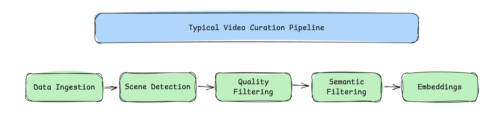
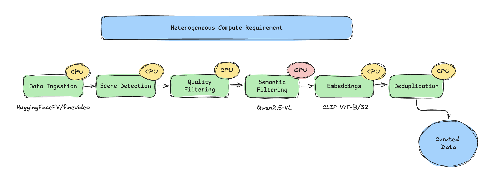
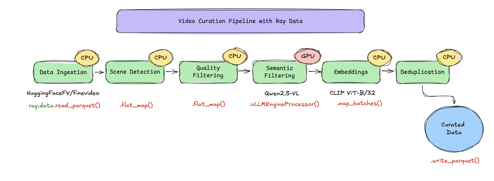

# Streaming Video Curation with Ray Data

This example builds a multimodal video curation pipeline with [Ray Data](https://docs.ray.io/en/latest/data/data.html) on [Anyscale](https://anyscale.com). It turns raw videos into clean, semantically-annotated clip datasets in a single streaming pipeline where CPU and GPU stages run concurrently with automatic backpressure.




## Pipeline

Videos are streamed directly from the [HuggingFaceFV/finevideo](https://huggingface.co/datasets/HuggingFaceFV/finevideo) dataset, eliminating the need for local prefetching. Each video is split on-the-fly into multiple clips, which are then streamed, processed, and written to Parquet format.

```
HF parquet (mp4 bytes)
    |
    +--flat_map(process_video_bytes)    # 1 video -> ~10 clips
    |     scene detect + quality filter + keyframe extraction (fused)
    |
    +--vLLMEngineProcessor              # 1:1, attaches category/is_safe/desc
    |     Qwen2.5-VL-3B, one replica per GPU
    |
    +--filter(is_safe)                  # drops unsafe rows
    |
    +--map_batches(CLIPEmbedder)        # 1:1, attaches 512-d embedding
    |     CLIP ViT-B/32 on CPU actor pool
    |
    +--write_parquet                    # /mnt/shared_storage/...
```

Each `.py` file has per-stage IO comments, see [`video_curation.py`](video_curation.py) for the full data-flow narrative.

The key idea is **streaming execution with heterogeneous resources**. Traditional staged pipelines run one stage at a time, GPUs sit idle during CPU stages. This pipeline chains all five stages so CPU and GPU work run concurrently:



[Ray Data](https://docs.ray.io/en/latest/data/data.html) executes each operation on the specified compute type, streams data block-by-block between operatins, and applies backpressure automatically.



## Install the Anyscale CLI

```bash
pip install -U anyscale
anyscale login
```

## Clone the example

```bash
git clone https://github.com/anyscale/examples.git
cd examples/video_curation_streaming
```
## Submit the job

[FineVideo](https://huggingface.co/datasets/HuggingFaceFV/finevideo) is a gated Hugging Face dataset, so you **must** set the `HF_TOKEN` environment variable.  
Pass your Hugging Face token to the job using the `--env` flag to enable dataset access.

```bash
export HF_TOKEN=hf_xxx

# Run the job on 20 videos
anyscale job submit -f job.yaml --env HF_TOKEN=$HF_TOKEN --env NUM_VIDEOS=20
```

To run the job on the full dataset, simply omit the `NUM_VIDEOS` flag. 

## Understanding the example

- This example uses two models: [Qwen2.5-VL-3B-Instruct](https://huggingface.co/Qwen/Qwen2.5-VL-3B-Instruct) for semantic understanding and [CLIP ViT-B/32](https://huggingface.co/sentence-transformers/clip-ViT-B-32) for embedding computations. Both models are public and automatically downloaded from Hugging Face.
- This workload creates curated parquet files that are saved to `/mnt/shared_storage/finevideo/curated/streaming_<timestamp>/`.
