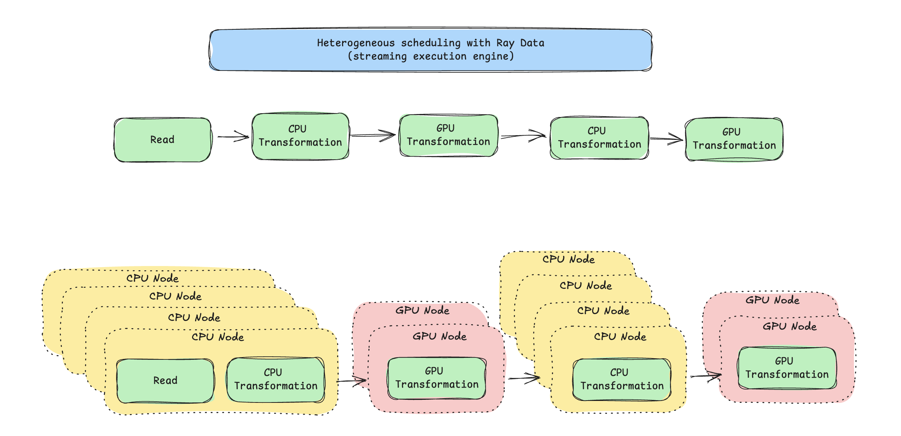

# Streaming Video Curation with Ray Data

This example builds a multimodal video curation pipeline with [Ray Data](https://docs.ray.io/en/latest/data/data.html) on [Anyscale](https://anyscale.com). It turns raw videos into clean, semantically-annotated clip datasets in a single streaming pipeline where CPU and GPU stages run concurrently with automatic backpressure.


Inspired by [NVIDIA NeMo Curator](https://github.com/NVIDIA-NeMo/Curator) and [Cosmos-Curate](https://github.com/nvidia-cosmos/cosmos-curate).

## Pipeline

Videos are streamed directly from [HuggingFaceFV/finevideo](https://huggingface.co/datasets/HuggingFaceFV/finevideo), no local prefetch. Rows fan out per-video into per-clip and stream to parquet:

```
HF parquet (mp4 bytes)
    |
    +--flat_map(process_video_bytes)    # 1 video -> ~10 clips
    |     scene detect + quality filter + keyframe extraction (fused)
    |
    +--vLLMEngineProcessor              # 1:1, attaches category/is_safe/desc
    |     Qwen2.5-VL-3B, one replica per GPU
    |
    +--filter(is_safe)                  # drops unsafe rows
    |
    +--map_batches(CLIPEmbedder)        # 1:1, attaches 512-d embedding
    |     CLIP ViT-B/32 on CPU actor pool
    |
    +--write_parquet                    # /mnt/shared_storage/...
```

Each `.py` file has per-stage IO comments, see [`video_curation.py`](video_curation.py) for the full data-flow narrative.

The key idea is **streaming execution with heterogeneous resources**. Traditional staged pipelines run one stage at a time, GPUs sit idle during CPU stages. This pipeline chains all five stages so CPU and GPU work run concurrently:


Ray Data's streaming executor places each operator on the right node type, flows data block-by-block between them, and applies backpressure automatically.



## Run

FineVideo is a gated [HuggingFace](https://huggingface.co/datasets/HuggingFaceFV/finevideo) dataset, so `HF_TOKEN` is mandatory. And use the flag `FULL_DATASET` if you wish to run it on the full dataset:

```bash
pip install -U anyscale
anyscale login
```

## Clone the example

```bash
git clone https://github.com/anyscale/examples.git
cd examples/video_curation_streaming
```
## Submit the job

```bash
export HF_TOKEN=hf_xxx

# 20 videos (default)
anyscale job submit -f job.yaml --env HF_TOKEN=$HF_TOKEN

# 10000 videos
anyscale job submit -f job.yaml --env HF_TOKEN=$HF_TOKEN --env NUM_VIDEOS=10000

# Full dataset (~44K videos, ignores NUM_VIDEOS)
anyscale job submit -f job.yaml --env HF_TOKEN=$HF_TOKEN --env FULL_DATASET=1
```

Models (Qwen2.5-VL-3B-Instruct, CLIP ViT-B/32) are public and downloaded from HF automatically. Curated parquet lands in `/mnt/shared_storage/finevideo/curated/streaming_<timestamp>/`.
